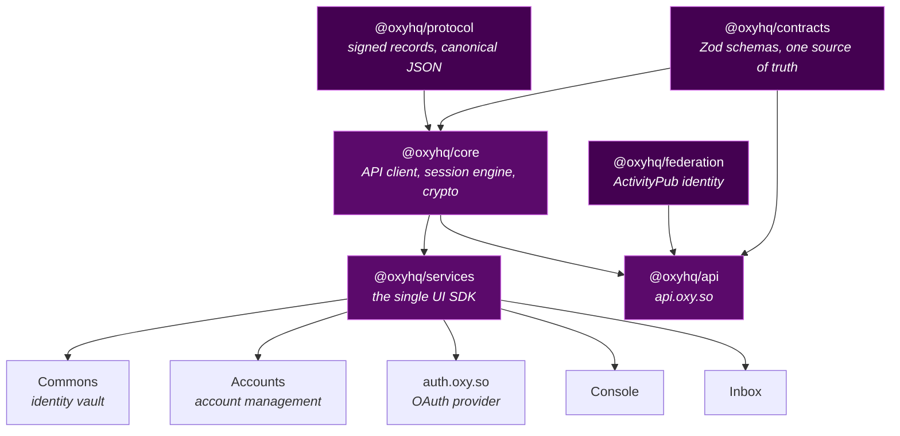

<p align="center">
  
</p>

<p align="center">
  <a href="https://github.com/OxyHQ"></a>
  <a href="https://github.com/FairCoinOfficial"></a>
  <a href="https://mention.earth/@oxy"></a>
</p>

<p align="center">
  <a href="https://www.npmjs.com/package/@oxyhq/services"></a>
  <a href="https://www.npmjs.com/package/@oxyhq/core"></a>
  <a href="LICENSE"></a>
  
  
</p>

<p align="center">
  <b>This is not an SDK repo with extras attached.</b><br>
  The SDK is one package of eighteen. So is the backend behind <code>api.oxy.so</code>,<br>
  the identity vault people install on their phones, and the OAuth provider third parties integrate against.
</p>

---

<table>
<tr>
<td valign="top" width="50%">

### 🔐 One session, every platform

A device holds a `{deviceId, deviceSecret}` pair per origin and mints short lived access tokens by presenting it. The server stores only a hash of the secret.

No cookies. No refresh token family. Cold boot restores the session without ever redirecting to a login page.

</td>
<td valign="top" width="50%">

### ✍️ Identity you actually own

Keys live on the person's device, in Commons. Records are signed client side and chained per subject, so ownership is proven by cryptography rather than granted by us.

DIDs resolve at `did:web:oxy.so:u:<id>`, reversible in both directions.

</td>
</tr>
</table>

## Map



### Inference and agents

Kaana and Alia are complementary, not interchangeable:

```text
one-shot product AI -> Oxy inference edge -> Kaana (https://kaana.ai)
agent or chat       -> Alia -> Oxy inference edge -> Kaana
```

Kaana executes model requests across providers. Alia owns agents,
conversations, memory, tools and approvals. Provider keys belong only to
Kaana's KMS-encrypted PostgreSQL store; they are never app or Alia environment
variables. See the [canonical request-routing guide](docs/inference/request-routing.md).

<table>
<tr>
<td valign="top" width="50%">

### 🧱 Substrate

| Package | What it is |
|---|---|
| [`@oxyhq/protocol`](packages/protocol/) | Signed record envelope, canonical JSON, signing and verification |
| [`@oxyhq/contracts`](packages/contracts/) | Contract first API schemas in Zod. Zero React or Expo, so server and clients share one source of truth |
| [`@oxyhq/federation`](packages/federation/) | App agnostic ActivityPub identity and follow layer |
| [`@oxyhq/core`](packages/core/) | API client, session engine, crypto, types. Node, browsers and React Native |

### 🚀 Server and SDK

| Package | What it is |
|---|---|
| [`@oxyhq/api`](packages/api/) | The Express backend behind `api.oxy.so` |
| [`@oxyhq/services`](packages/services/) | **The single UI SDK.** Expo, React Native and web through React Native Web |
| [`@oxyhq/node`](packages/node/) | Self hostable personal data node for a user's own signed records |

</td>
<td valign="top" width="50%">

### 📱 Applications

| App | What it is |
|---|---|
| [Commons](packages/commons/) | Native identity vault. Creation, signed records, domain verification, sign in approvals |
| [Accounts](packages/accounts/) | Keyless account management: sessions, privacy, settings |
| [auth](packages/auth/) | `auth.oxy.so`, the OAuth authorize and consent provider |
| [Console](packages/console/) | `console.oxy.so`, application registry and credentials |

### 🛠 Tooling

| Package | What it is |
|---|---|
| [`create-oxy-app`](packages/create-oxy-app/) | `bun create oxy-app`, scaffolds a new app in the canonical shape |
| [`@oxyhq/app-preset`](packages/app-preset/) | The Oxy distro of Expo: config plugin and Metro, Babel, CSS, ESLint bases |
| [`@oxyhq/expo-splash`](packages/expo-splash/) | Shared native splash toolkit |
| [`@oxyhq/ship`](packages/ship/) | `oxy-ship`, publishes Expo OTA updates |

</td>
</tr>
</table>

> There is no separate web only auth SDK. Web apps use `@oxyhq/services` through React Native Web, so every platform shares one provider and one auth UI.

## Quick start

```bash
bun install && bun run build:all
```

Requires Node 18+ and Bun 1.3+. Build order comes from the dependency graph: `contracts` → `protocol` → `core` → `services` → everything else.

<details>
<summary><b>React: Expo, React Native, or web</b></summary>

<br>

```tsx
import { OxyProvider, useAuth } from "@oxyhq/services";

function App() {
  return (
    <OxyProvider clientId={process.env.OXY_CLIENT_ID} baseURL="https://api.oxy.so">
      <MyComponent />
    </OxyProvider>
  );
}

function MyComponent() {
  const { user, signIn, isAuthenticated } = useAuth();
  if (!isAuthenticated) return <button onClick={() => signIn()}>Sign in</button>;
  return <p>Welcome, {user?.username}</p>;
}
```

`signIn()` opens the in app dialog: the accounts already on this device, plus one **Continue with Oxy** action. Oxy picks how the request reaches the identity — opening Commons, pushing to it, or showing a QR — instead of asking the person to choose a transport.

</details>

<details>
<summary><b>Node backends</b></summary>

<br>

```ts
import { OxyServices, oxyClient } from "@oxyhq/core";

const user = await oxyClient.getUserById("user-id");

const oxy = new OxyServices({ baseURL: "https://api.oxy.so" });
const profile = await oxy.getProfileByUsername("johndoe");
```

Protect routes with `@oxyhq/core/server`: `createOxyAuthMiddleware`, `requireOxyAuth`, `getRequiredOxyUserId`, plus `safeFetch` for SSRF safe outbound requests and `createOxyCors` for a deny by default CORS policy.

</details>

<details>
<summary><b>Development commands</b></summary>

<br>

```bash
bun run build:all   # build every package in dependency order
bun run start       # run the API server
bun run dev         # dev mode across workspaces
bun run test        # tests, turbo dispatches each package's own runner
```

Packages never re-export from one another. Apps import `@oxyhq/services` for the provider and UI, `@oxyhq/core` for types and services, and `@oxyhq/contracts` for schemas.

</details>

## Contributing

Issues and pull requests are welcome, especially from people who will tell us when something is badly designed. The mission is not a marketing layer, it is the part we are trying to protect.

<br>

<div align="center">
<sub>Apache-2.0 for the SDK packages · Breathe License 1.0 for the server layer · The Oxy Collective, Inc. · <a href="LICENSE">LICENSE</a></sub>
</div>
