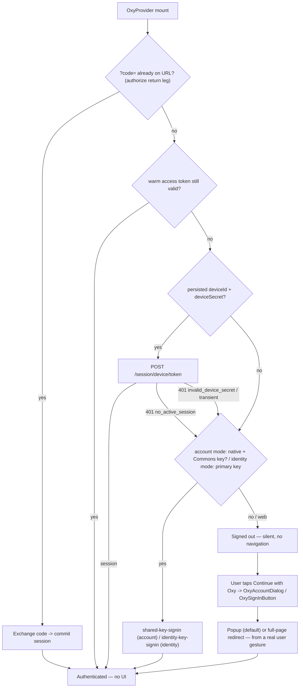
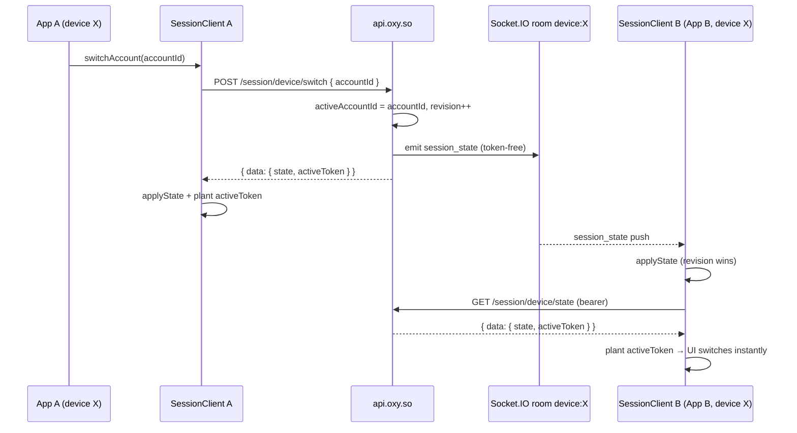

# Session Architecture

> Device-first session model for the Oxy ecosystem. The server is the single session
> authority (`DeviceSession`); clients mirror it through `SessionClient` in `@oxyhq/core`
> and receive real-time pushes over Socket.IO. There is **one** UI SDK: `@oxyhq/services`
> (`OxyProvider`) — the former web-only SDK package was deleted from the monorepo.
>
> Related docs: [device-session API reference](./auth/device-session.md) ·
> [third-party integration guide](./auth/integration-guide.md) ·
> [platform master plan](./architecture/oxy-auth-platform.md)

## Principles

- **Server authority.** Which accounts are signed in on a device — and which one is
  active — lives in one `device_sessions` row per device. Clients never own that state; they
  project it.
- **Silent cold boot.** `OxyProvider` restores the session on mount with zero UI. It never
  redirects to a login page and never opens a dialog on its own. Signed-out is a silent,
  valid outcome; interactive sign-in is always user-initiated (profile button →
  `OxyAccountDialog`).
- **Tokens never ride the socket.** Socket pushes carry token-free state only. Access
  tokens are minted and delivered exclusively over authenticated REST.
- **One write path.** Every mutation (add / switch / sign-out) goes through
  `/session/device/*`, bumps `revision`, and broadcasts — so every app on the device
  converges instantly.

## Server authority: `DeviceSession`

Model: `packages/api/src/models/DeviceSession.ts` (collection `devicesessions`).

```
deviceId          string   unique — stable identifier for one device/origin
accounts[]        { accountId, sessionId, authuser, addedAt, operatedByUserId? }
activeAccountId   ObjectId | null
secretHash        sha256 of the current deviceSecret (sparse-unique; see Transport)
prevSecretHash    sha256 of the just-superseded secret (short grace; transient)
revision          number   monotonic — $inc on every mutation
```

`accounts[]` is the **device set**: the accounts currently signed in on this device.
`operatedByUserId` records the human operator when the entry is a managed account
(org/project/bot) — audit trail for `act_as` switches. `revision` gives clients a total
order: state application is last-writer-wins by revision across the device set.

### REST surface (`/session/device/*`)

Routes: `packages/api/src/routes/sessionDevice.ts`. All routes except the mint require a
bearer token; the `deviceId` is always derived from the **validated JWT claim**, never
from the request body.

| Method | Route | Body | Behavior |
|--------|-------|------|----------|
| POST | `/session/device/token` | `{ deviceId, deviceSecret }` | **The zero-cookie mint** — PUBLIC (no bearer, no cookies): possession of the secret is the device-ownership proof. Verifies `sha256(deviceSecret)` (constant-time) against the device's `secretHash`, mints a short access token for the active account, and returns the proven secret unchanged as `nextDeviceSecret`. Keeping the credential stable lets multiple official apps/origins sharing one device refresh concurrently. Per-device lockout + rate limit blunt online guessing. |
| GET | `/session/device/state` | — | Returns current state for the caller's JWT device. |
| POST | `/session/device/add` | — | Registers the caller's account into the device set. Account + session ids come from the bearer (IDOR-safe); `operatedByUserId` is resolved from the session document. Idempotent — an unchanged re-register does not broadcast. |
| POST | `/session/device/switch` | `{ accountId }` | Sets `activeAccountId`, bumps `revision`, broadcasts. If the target session was revoked, heals the device set (drops the dead account), broadcasts the healed state, and returns 403. |
| POST | `/session/device/signout` | `{ accountId }` or `{ all: true }` | Removes one account or clears the device set; picks the next active account; broadcasts. `{ all: true }` also clears the device's `secretHash`. |

Every response is validated against `deviceSessionSyncSchema` from `@oxyhq/contracts`:

```
{ data: { state: DeviceSessionState, activeToken: { accessToken, expiresAt } | null } }
```

Contracts (`packages/contracts/src/deviceSession.ts`): `sessionAccountSchema`,
`deviceSessionStateSchema`, `activeTokenSchema`, `deviceSessionSyncSchema` — shared by
the server (output validation) and `SessionClient` (input validation).

## Session transport (device-first)

The transport that carries "which device is this?" across reloads is **`deviceId` +
`deviceSecret`** — no refresh-token family, no boot-fragment hop, and, on every
relying-party origin, no cookie.

> **The one cookie, and where it lives.** Issue #937 Phase 5
> ([ADR 0003](adr/0003-browser-device-session-hub.md)) reopens exactly one of the
> mechanisms the zero-cookie cutover deleted, at exactly one origin.
> **Relying-party origins remain zero-cookie** and set no cookie of any kind.
> **`auth.oxy.so` alone** holds `__Host-oxy-device` — host-only (no `Domain`),
> `Secure`, `HttpOnly`, `SameSite=Lax`, `Path=/` — whose value is an opaque random
> handle and nothing else. The server stores only `sha256(handle)`. It is a
> POINTER to a server-side `DeviceSession`, never a credential the browser can
> spend against the resource API, and it is never required in a third-party
> context. See "The browser hub" below.

1. **`deviceId` + `deviceSecret`** — every successful sign-in (password, 2FA, QR claim,
   challenge verify) returns the session's `deviceId` and a 256-bit `deviceSecret`. The
   client persists both first-party (localStorage on web per origin; SecureStore on
   native). The server stores only `sha256(deviceSecret)` (`DeviceSession.secretHash`,
   sparse-unique), so a database dump cannot forge the secret and the secret reveals
   nothing about any other device.
2. **Mint** — to restore or refresh, the client POSTs `{ deviceId, deviceSecret }` to
   `POST /session/device/token` (no bearer, no cookies). The server verifies the secret
   (constant-time) and returns a short access token for the active account plus the same
   proven secret as `nextDeviceSecret`. The credential is intentionally stable: several
   official apps/origins can share a `DeviceSession` without rotating one another out.
3. **Revocation** — sign-out-all (`POST /session/device/signout { all: true }`) clears
   `secretHash` so a retained secret can never mint again. A theft divergence is detected
   at the next mint (the loser's secret no longer matches → `invalid_device_secret`).
4. **Cross-origin convergence is USER-INITIATED (zero cookies).** Each web origin
   persists its own `{ deviceId, deviceSecret }` copy in `localStorage`. Official apps
   (including custom domains like `mention.earth`) and third-party RPs converge on the
   **same** server-side `DeviceSession` only when the user actually signs in on that
   origin: the authorize round trip threads the same `deviceId`, so the origin ends up
   holding a credential for the device session it just joined. Once each app holds a
   bearer, realtime changes propagate over Socket.IO `session_state` on
   `device:<deviceId>`.

   There is **no automatic convergence**. An origin the user has never signed in on
   cold-boots SIGNED OUT and stays there until the user's next explicit "Continue with
   Oxy" — the SDK never navigates the top-level window by itself. Both mechanisms that
   used to do it were removed in issue #691 phase 7b, in every `webAuthMode`:

   - **Silent OAuth restore** (`prompt=none` cold-boot bounce to
     `auth.oxy.so/authorize`) — gone, on both ends. `crossOriginRestore.ts` and the
     `allowsAutomaticIdpRedirect` gate were deleted; `'none'` was removed from the
     `prompt` union of `buildOAuthAuthorizeUrl` so it cannot be rebuilt in one line;
     and the IdP refuses an `authorize?prompt=none` it receives anyway with a visible
     terminal screen instead of a silent redirect back, so it cannot be hidden in an
     iframe or a background tab.
   - **Hub-ticket sync** (`POST /session/device/hub-ticket` +
     `/session/device/redeem-ticket` → a one-time redirect to `auth.oxy.so/sync`) —
     gone, including the server routes, service, model, rate limiters, and the
     `@oxyhq/contracts` ticket schemas.

   Do not reintroduce either. The accepted trade is explicit: a signed-out first visit
   on a new origin, in exchange for a tab that never leaves the relying party's route
   without the user asking.

## Cold boot

`runSessionColdBoot` (`packages/core/src/boot/sessionColdBoot.ts`, exported from
`@oxyhq/core`) is a pure ordered short-circuit: the first step that yields a session
wins. `@oxyhq/services`' `runProviderColdBoot` (`packages/services/src/ui/boot/`) wraps
it with the web-only OAuth-return lane described below. It is invoked by `OxyProvider`
on mount — apps never implement restore themselves, and the boot never navigates the
top-level window.

**Two session modes** (`OxyProvider` prop `sessionMode: 'account' | 'identity'`, default
`'account'`; issue #691 Phase 1): `'account'` is every ordinary Oxy app — the device's
active account owns the session. `'identity'` is Commons — the owner of THIS device's
PRIMARY identity key owns the session PERMANENTLY, independent of the device's mutable
`activeAccountId`. Each step below is bound to a persisted `{publicKey, accountId}` pin
(`packages/core/src/session/identityPin.ts`) reconciled against the live
`KeyManager.getPublicKey()`; `switchToAccount`/`switchSession` throw
`IdentityBoundSessionError` in this mode instead of switching.

`runSessionColdBoot` steps, in order:

1. **`warm-token-plant`** (web + native) — when the persisted store already holds a
   still-valid access token (expiry more than the refresh-lead window away) plant it
   AS-IS with zero network round-trip. In `'identity'` mode the token is only accepted
   when it belongs to the PINNED account (checked against both the stored `userId` and
   the token's own identity-tag claim).
2. **`device-secret-mint`** (web + native) — when the origin persisted a `deviceId` +
   `deviceSecret`, mint a short access token with a single bearer-less POST to
   `/session/device/token`, persist the rotated secret, plant the token. In `'account'`
   mode this mints for the device's active account; in `'identity'` mode it passes the
   pinned `accountId` as the optional `accountId` field of that same request (see
   [device-session.md](./auth/device-session.md)) — a rejected pin
   (`account_not_on_device`) falls through to step 3 without dropping the secret. A
   `no_active_session` 401 is an authoritative signed-out; an `invalid_device_secret` 401
   drops the (diverged) secret and falls through.
3. **`shared-key-signin`** (native, `'account'` mode) — re-mint from the shared Commons
   identity in the app-group keychain — **replaced by `identity-key-signin`** in
   `'identity'` mode, which re-mints from THIS device's PRIMARY key
   (`KeyManager.getPublicKey()` → challenge → sign → `verifyChallenge`) and
   (re)establishes the identity pin. Both are network steps, gated on the same
   best-effort offline hint as step 2, and both run with `{ retry: false }` (the proactive
   refresh scheduler and the reactive 401 lane own retries).

If nothing yields a session, `runSessionColdBoot` resolves signed out — silently, with no
navigation and no dialog. One more lane runs around it, in `@oxyhq/services`, for WEB
apps in `'account'` mode only (it is inert in `sessionMode: 'identity'`, which would
otherwise commit whichever account the IdP resolves rather than the local key's owner):

4. **OAuth authorization-code return** (`tryCompleteOAuthReturn`) — consumes a `?code=`
   **already on the URL**, BEFORE `runSessionColdBoot` runs. Always enabled in both
   `webAuthMode`s: this is not a navigation the SDK started, it is the return leg of a
   full-page authorize the user themselves triggered — either an explicit
   `webAuthMode: 'redirect'` sign-in or a `'popup'` sign-in whose window the browser
   blocked and which fell back to a redirect. It is also the single cleanup path for an
   OAuth `?error=` landing on the URL (the params and the stale PKCE handshake are
   stripped, and the boot continues).

There is no fifth lane. The `prompt=none` silent cross-origin restore that used to run
here was deleted in issue #691 phase 7b, in **both** transports — not gated, removed.
A web origin with no local device credential resolves signed out and waits for the
user's next explicit "Continue with Oxy".

The proactive scheduler + the reactive 401 handler both re-mint via the same
`deviceSecret` path (`refreshPersistedSession`), so a long-lived session stays alive past
the short access-token TTL without any refresh token.



## `SessionClient` (`@oxyhq/core`)

`packages/core/src/session/` — a framework-agnostic client mirror of the server state.
Exported from `@oxyhq/core` as `SessionClient`, plus the wiring helpers
`createSessionClient` and `createSessionClientHost`. `OxyProvider` constructs it; apps
consume it only through hooks.

Key behavior:

- `getState()` / `subscribe(listener)` — synchronous access to the current
  `DeviceSessionState` projection.
- `bootstrap()` — initial `GET /session/device/state` fetch + token plant.
- `switchAccount(accountId)` / `signOut({ accountId } | { all: true })` /
  `addCurrentAccount()` / `registerAndActivate()` — the only mutation paths; each calls
  the corresponding REST route and applies the returned sync.
- **`applyState` is last-writer-wins by `revision`** across the device set — a stale
  push or response can never regress newer state.
- **`applySync`** validates `{ state, activeToken }` against `deviceSessionSyncSchema`
  and plants the access token host-side; token planting is decoupled from revision
  advancement (an idempotent re-fetch still plants).
- `start()` attaches the Socket.IO listener; when the device set empties,
  `onUnauthenticated` clears the persisted store so a reload cannot restore a dead
  session.

## Real-time sync: `session_state`

Server side (`packages/api/src/utils/socket.ts`): each authenticated socket joins the
room `device:<deviceId>` — the id is derived from the **validated JWT claim**
(`deviceRoomFor`), never from a client-supplied value. Every `DeviceSession` mutation
calls `broadcastDeviceState(state)`, which emits `session_state` to that room with the
**token-free** `DeviceSessionState` payload.

Client side: on a `session_state` push, `SessionClient` applies the state
(revision-gated) and then asks its transport to `ensureActiveToken` — an authenticated
`GET /session/device/state` that returns `{ state, activeToken }` and plants the token.
Tokens therefore only ever travel over authenticated REST.

### Switch → broadcast (cross-app, same device)



## Multi-account: device set + account graph

Two distinct layers — do not conflate them:

| Layer | What it is | API |
|-------|-----------|-----|
| **DeviceSession** (device set) | Accounts signed in **on this device** right now | `/session/device/*`, `SessionClient` |
| **Account graph** | Accounts the user **may** use — own, child orgs/projects/bots, shared via membership | `GET /accounts`, `POST /accounts/:id/switch` (`account.service.ts`) |

The account switcher (`OxyAccountDialog`) shows both: the device set, plus graph accounts
available for `act_as` that are not yet signed in here.

Switch semantics (`useOxy().switchToAccount(accountId)`):

- **Account already in the device set** → `POST /session/device/switch` — flips
  `activeAccountId`, no new session minted.
- **Graph account not yet in the device set** (first entry) → `POST /accounts/:id/switch`
  mints a real session with `operatedByUserId` set to the operator, then registers it via
  `POST /session/device/add` — after which it switches like any other account. One
  uniform path; minting happens only on first entry.

Because the state lives server-side keyed by device, **a switch persists across reloads**
— the next cold boot reads the same `DeviceSession` and restores the same
`activeAccountId`. Signing an account out of the device set never revokes its graph
membership. See [device-session.md](./auth/device-session.md) for the full API detail.

## SDK surface

`@oxyhq/services` is the single UI SDK for Expo, React Native, and React Native Web. Auth state is implemented in a split context layer under `packages/services/src/ui/context/`:

| Module | Role |
|--------|------|
| `OxyContext.tsx` | `OxyProvider` / `useOxy()` — session commit, cold boot, token side-effects |
| `oxyContextTypes.ts` | `OxyContextState`, `PasswordSignInResult` |
| `useOxyAccountGraph.ts` | `accounts`, `switchToAccount`, `createAccount` |
| `navigation/accountDialogManager.ts` | Imperative `openAccountDialog('signin')` |

```tsx
import { OxyProvider, useAuth, OxySignInButton } from '@oxyhq/services';

export function App() {
  return (
    <OxyProvider clientId={process.env.OXY_CLIENT_ID} baseURL="https://api.oxy.so">
      <Home />
    </OxyProvider>
  );
}

function Home() {
  const { isAuthenticated, signIn } = useAuth();
  if (!isAuthenticated) return <OxySignInButton />;
  return <Dashboard />;
}
```

- **`useAuth().signIn()`** opens the in-app dialog — interactive sign-in is never a
  redirect to a login page.
- **`OxyAccountDialog`** — the single account surface (switcher + sign-in), built on
  Bloom `<Dialog placement={{ base: 'bottom', md: 'center' }}>`. Opened via
  `useOxy().openAccountDialog()`. Its sign-in entry (issue #691, Phase 5) shows existing
  device accounts plus ONE primary "Continue with Oxy" action — Oxy picks the delivery
  route automatically (same-device Commons deep link → known-install push → QR; see
  [device-session.md](./auth/device-session.md) § Automatic delivery). There is no
  password option; scan-QR / passkey-on-this-device / "Get Commons" sit behind a
  collapsed "Having trouble?" disclosure.
- **`OxySignInButton`** resolves the registered Application via
  `GET /auth/oauth/client/:clientId`: official apps open the dialog in-app;
  `third_party` apps sign in via OAuth + PKCE (`generatePkcePair`, `generateOAuthState`,
  `buildOAuthAuthorizeUrl` from `@oxyhq/core`). On web the transport is `OxyProvider`
  prop `webAuthMode: 'popup' | 'redirect'` (default `'popup'`; issue #691 Phases 2/7b) —
  `'popup'` opens a small `auth.oxy.so` window and relays the result via `postMessage`
  instead of navigating the relying party's tab, falling back to a full-page redirect if
  the browser blocks it; `'redirect'` always does the full-page navigation. Either way
  the hop only ever starts from a real user gesture. See the
  [integration guide](./auth/integration-guide.md).
- **`OxyConsentScreen`** — the IdP's OAuth consent surface, exported from
  `@oxyhq/services` and mounted by auth.oxy.so.

### IdP exception

auth.oxy.so is the OAuth authorize/consent surface, **not** a relying party. It mounts
`OxyProvider` device-first like every Oxy app (normal cold boot from its own per-origin
`{deviceId, deviceSecret}`, `useDeviceSwitcher` chooser) but stays a SHELL that emits
the OAuth code after authenticating — it does not bounce elsewhere for its own session.
It redirects all `/settings/*` paths to accounts.oxy.so, which is the sole owner of
account management. (The former `coldBoot={false}` exception existed for the deleted
SSO bounce.)

### Removed

FedCM, the silent-restore iframe, the cross-domain redirect-chain restore, and the
legacy client-side auth manager were all deleted earlier. The **zero-cookie cutover**
then deleted the entire cookie/refresh transport: the `oxy_device` cookie
(`cookieKeyHash`, the `/auth/device/bootstrap` + `/auth/device/exchange` +
`/auth/device/web-session` hop, the `#oxy_boot` fragment), the rotating refresh-token
family (`/auth/refresh-token`, `/auth/logout`), and the opaque device-attribution token
(the `POST /auth/device/token` native mint, the shared-keychain device token, and the
anonymous device socket). Sockets are **bearer-only** — a signed-out client opens no
socket.

Issue #691 phase 7b then removed the last two SDK-initiated, gesture-less full-page
navigations to the IdP: the cold-boot **`prompt=none` silent restore**
(`crossOriginRestore.ts`, `legacyRedirectLanes.ts`, and `'none'` as an accepted `prompt`
value on `buildOAuthAuthorizeUrl`) and the post-sign-in **hub-ticket sync**
(`hubSync.ts`, the `auth.oxy.so/sync` page, `POST /session/device/hub-ticket` +
`/session/device/redeem-ticket`, the `DeviceHubTicket` model, and the ticket schemas in
`@oxyhq/contracts`). `webAuthMode` now defaults to `'popup'` and only picks the transport
for a sign-in the user actually asked for.

Cold boot is the device-secret chain above plus the `?code=` return leg — nothing else.
Do not reintroduce a refresh-token family, a boot-fragment hop, an anonymous device
socket, per-app session restore, a silent `prompt=none` bounce, or a hub-sync redirect.
Do not add a cookie to any relying-party origin; the ONE cookie the platform now has is
`auth.oxy.so`'s own `__Host-oxy-device`, described next.

## The browser hub (`auth.oxy.so`)

Issue #937 Phase 5, [ADR 0003](adr/0003-browser-device-session-hub.md). A browser
profile that authenticated on one origin used to start signed out on the next, because
each origin holds its own `{deviceId, deviceSecret}` and nothing may read another's. The
hub closes that without any of the browser tricks the cutover deleted: `auth.oxy.so`
keeps a first-party `DeviceSession` for the profile, and a later official origin joins it
over ordinary Authorization Code + PKCE.

**The handle.** `__Host-oxy-device=<opaque random handle>; Secure; HttpOnly;
SameSite=Lax; Path=/`, plus a `Max-Age` derived from the same
`BROWSER_HUB_HANDLE_TTL_MS` the server writes into `device_sessions.hub_secret_expires_at`
— the cookie and the credential expire together. The `__Host-` prefix makes the browser
itself refuse a `Domain`, so no other `oxy.so` host can read or overwrite it. The value
carries no token, user id, device id, account id or serialized state; the server stores
only `sha256(handle)`. Rotation keeps the previous hash for a short grace window, because
a browser's tabs share one cookie jar.

**The server half** — `POST /session/browser-hub/{establish,resolve,rotate,revoke}`
(`packages/api/src/routes/browserHub.ts`). `establish` takes a first-party bearer and
returns the raw handle exactly once; the other three take the handle itself, since
possession is the proof. `signout({all:true})` clears the hub credential with the rest,
so a retained cookie cannot keep resolving a device that was just signed out.

**The edge half** — `POST /hub/{session,claim,activate,authorize,rotate,revoke}`, a
Cloudflare Pages Functions *directory* at `packages/auth/functions/hub/` over handlers in
`packages/auth/hub/`. Neither credential reaches the page: the handle is `HttpOnly`, and
the device-wide access token the API mints from it is used at the edge and discarded —
which is why `/hub/authorize` runs the consent + authorize calls server-side instead of
handing the SPA a bearer. CSRF is live again for these six and nowhere else: `POST`-only,
`Origin` exactly equal to the deployment's own origin (absent is refused),
`Sec-Fetch-Site: same-origin` when sent, and a required `X-Oxy-Hub: 1`.

**The page half, and the flag.** `VITE_OXY_BROWSER_HUB=1` routes `/authorize` to
`packages/auth/src/pages/hub-authorize.tsx` and mounts `OxyProvider` with
`deviceCredentialStorage="ephemeral"`; unset — the default — leaves the IdP
byte-for-byte as it was, with not one `/hub/*` request made. `ephemeral` is what makes
the hub AUTHORITATIVE rather than merely first in line: the origin persists no
`{deviceId, deviceSecret}` of its own, so there is exactly one durable credential for
the browser profile. "Try the hub, else localStorage" would be the same dual authority
under a politer name, and its failure mode is a revoked hub the browser silently
survives.

With the flag on, a browser the hub knows goes straight to a code (resolve → pick a
context if there is more than one → mint). A browser it does not know runs ONE Commons
approval that establishes the hub (`lib/hub-establish.ts`) and then takes the first
lane. That is a plain `device_sign_in` request, not the OAuth-bound one the ordinary
page uses: an OAuth approval mints no session by design, so it could never establish a
hub, and a browser that joined that way would be back at a QR on the next origin.

**Flipping the flag is the browser-verification gate** — it comes out when somebody has
run Chrome, Safari and Firefox, private windows, and third-party-cookies-blocked against
the lane, never on reasoning.

**Still forbidden**, unchanged: third-party cookies, hidden or silent iframes,
cross-origin `localStorage`, Storage Access API as the mechanism, gesture-less popups,
silent `prompt=none` loops, FedCM, and automatic redirect chains across Oxy origins. No
hub endpoint answers with a redirect, and the hub page refuses `prompt=none` before
doing any work at all.
