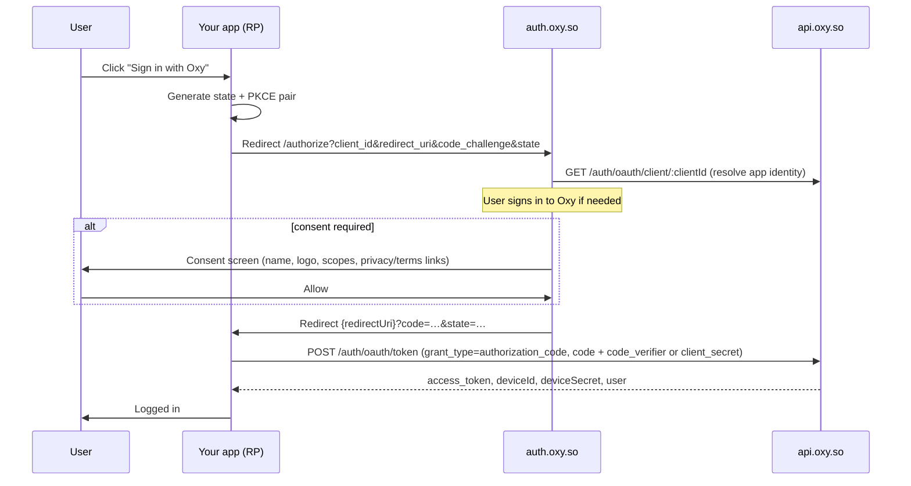

# Sign in with Oxy — Third-Party Integration Guide

> **Audience:** developers integrating "Sign in with Oxy" into an app that is **not** an official Oxy app — any web SPA, server-rendered site, or native app on any domain.
> **Model:** standard OAuth 2.0 Authorization Code, with PKCE (RFC 7636, S256) for public clients. No browser tricks, no Oxy session cookies on your domain, no hidden iframes, and nothing that reaches `auth.oxy.so` on page load — a hop to `auth.oxy.so` and back that only ever starts from the user's click. Build it yourself as a plain top-level redirect (Steps 2–4), or let `@oxyhq/services` run it as a popup that leaves your page mounted ([Step 5](#popup-mode--keep-your-page-mounted-issue-691-phases-27b)).
>
> Official Oxy apps integrate differently (in-app dialog + device-session sync) — see [`docs/auth/device-session.md`](./device-session.md). This guide is for everyone else.

The mental model is the same as Google Sign-In:

| Google | Oxy |
|--------|-----|
| Google Cloud Console → OAuth client | **Oxy Console** ([console.oxy.so](https://console.oxy.so)) → Application + Credential |
| `client_id` | `oxy_dk_…` (an `ApplicationCredential` public key) |
| Consent screen | `auth.oxy.so/authorize` + `OxyConsentScreen` |
| OAuth 2.0 Authorization Code + PKCE | `auth.oxy.so/authorize` → `POST api.oxy.so/auth/oauth/token` |
| "Sign in with Google" button | `OxySignInButton` from `@oxyhq/services`, or your own link |
| Connected apps in Google Account | Accounts → Connected apps (`GET /auth/grants`, revoke) |

---

## How it works



Key properties:

- The diagram is the **redirect** transport — what Steps 2–4 build by hand. `@oxyhq/services`' default popup transport swaps the two `Redirect` arrows for a `window.open` + `postMessage` back to the opener; every other step, including the token exchange, is identical.
- The flow only ever starts from a user gesture. Nothing in it runs on page load.
- The authorization code is **single-use** and expires after ~60 seconds. Replay, expiry, or a `redirect_uri` mismatch all return the same `400 invalid_grant`, with one shared description that never says which check failed.
- Tokens are **never in a URL** — only the short-lived `code` and your `state` cross the redirect.
- The user's Oxy session lives on Oxy's own origins. Your app only ever holds the OAuth tokens it was issued.
- Consent is recorded as an `AppGrant`. The user can revoke it at any time from their Oxy account, after which the next sign-in prompts for consent again.

---

## Step 1 — Register your application (Console)

1. Sign in to [console.oxy.so](https://console.oxy.so) and create (or pick) a **Workspace**.
2. **Applications → Create** with `type: third_party`.
3. Configure:
   - **Name, logo, description** — shown to the user on the consent screen.
   - **`redirectUris[]`** — matched **exactly** (RFC 6749 §3.1.2). e.g. `https://merchant.example/auth/callback` or `myapp://oauth/callback` for native. No wildcards, no prefix matching.
   - **`scopes`** — the permissions your app will request (default `openid profile`).
   - **`privacyPolicyUrl` / `termsUrl`** — rendered as legal links on the consent screen.
4. **Credentials → Create:**
   - **`public`** — for SPAs and native apps. No secret ships in the client; the code exchange is proven with PKCE.
   - **`confidential`** — for backends that can keep a `clientSecret`. The secret is shown **once** on create/rotate and only ever used server-side.

Your **`client_id`** is the credential's public key (`oxy_dk_…`).

---

## Step 2 — Web SPA (public client + PKCE)

Use the helpers from `@oxyhq/core` — `generatePkcePair()`, `generateOAuthState()`, and `buildOAuthAuthorizeUrl()` (see `packages/core/src/utils/oauthPkce.ts`). They run identically on web, Node, and React Native.

**Start the flow** (e.g. from your sign-in button's click handler):

```typescript
import { generatePkcePair, generateOAuthState, buildOAuthAuthorizeUrl } from '@oxyhq/core';

const OXY_CLIENT_ID = 'oxy_dk_your_client_id';
const REDIRECT_URI = 'https://merchant.example/auth/callback';

async function startSignInWithOxy(): Promise<void> {
  const [pkce, state] = await Promise.all([generatePkcePair(), generateOAuthState()]);

  // Persist the handshake so the callback page can validate `state` and
  // replay the verifier after the full-page redirect.
  sessionStorage.setItem('oxy_oauth_state', state);
  sessionStorage.setItem('oxy_oauth_code_verifier', pkce.codeVerifier);

  window.location.assign(
    buildOAuthAuthorizeUrl({
      clientId: OXY_CLIENT_ID,
      redirectUri: REDIRECT_URI,
      state,
      codeChallenge: pkce.codeChallenge,
      // scope defaults to 'openid profile'; authorizeBaseUrl defaults to
      // https://auth.oxy.so/authorize
    }),
  );
}
```

**Handle the callback** at your registered `redirectUri`:

```typescript
// The token endpoint is RFC 6749 compliant: the response is FLAT — every member
// sits at the top level, with no `data` wrapper. `scope`, `session_id`,
// `deviceId`, `deviceSecret` and `user` are additional parameters, which
// RFC 6749 §5.1 explicitly permits.
interface OxyTokenResponse {
  access_token: string;
  token_type: 'Bearer';
  expires_in: number; // seconds (access token; currently 900)
  scope?: string; // space-delimited granted scopes; omitted when the grant carries none
  session_id: string;
  deviceId: string;
  deviceSecret: string;
  user: { id: string; username?: string; name?: { displayName?: string } };
}

async function handleOAuthCallback(): Promise<OxyTokenResponse> {
  const params = new URLSearchParams(window.location.search);
  const code = params.get('code');
  const returnedState = params.get('state');

  const expectedState = sessionStorage.getItem('oxy_oauth_state');
  const codeVerifier = sessionStorage.getItem('oxy_oauth_code_verifier');
  sessionStorage.removeItem('oxy_oauth_state');
  sessionStorage.removeItem('oxy_oauth_code_verifier');

  if (!code || !returnedState || !expectedState || returnedState !== expectedState || !codeVerifier) {
    throw new Error('Sign in with Oxy: state validation failed');
  }

  // A standard RFC 6749 §4.1.3 token request: form-urlencoded, snake_case
  // parameter names, explicit `grant_type`. Any OAuth client library speaks it.
  const response = await fetch('https://api.oxy.so/auth/oauth/token', {
    method: 'POST',
    headers: { 'Content-Type': 'application/x-www-form-urlencoded' },
    body: new URLSearchParams({
      grant_type: 'authorization_code',
      code,
      redirect_uri: 'https://merchant.example/auth/callback',
      client_id: 'oxy_dk_your_client_id',
      code_verifier: codeVerifier,
    }),
  });
  if (!response.ok) {
    // Errors are RFC 6749 §5.2: { error, error_description }.
    const { error, error_description } = await response.json();
    throw new Error(`Sign in with Oxy: token exchange failed (${error}: ${error_description})`);
  }

  const tokens = (await response.json()) as OxyTokenResponse;
  // Persist tokens.access_token plus the device credential pair
  // (tokens.deviceId + tokens.deviceSecret) in your app's own storage
  // (localStorage, memory, etc.). Restore later via
  // POST /session/device/token and call your APIs with
  // `Authorization: Bearer <access_token>`.
  return tokens;
}
```

Alternatively, render `<OxySignInButton />` from `@oxyhq/services` and let the SDK generate the PKCE pair and redirect for you — see [Step 5](#step-5--the-oxysigninbutton-sdk-ui). On web the button persists the handshake under the exported `OXY_OAUTH_STATE_STORAGE_KEY` / `OXY_OAUTH_CODE_VERIFIER_STORAGE_KEY` `sessionStorage` keys, which your callback reads back exactly as above.

---

## Step 3 — Server-side web app (confidential client)

Same authorize redirect as Step 2 (state is still required; PKCE is optional for confidential clients), but the **code→token exchange happens on your backend**, authenticated with the credential secret:

```http
POST https://api.oxy.so/auth/oauth/token
Content-Type: application/x-www-form-urlencoded

grant_type=authorization_code&code=…&redirect_uri=https%3A%2F%2Fmerchant.example%2Fauth%2Fcallback&client_id=oxy_dk_your_client_id&client_secret=<secret — server-side only>
```

HTTP Basic (`client_secret_basic`) works too, and is what most OAuth libraries
send by default — put `client_id` and `client_secret` in an
`Authorization: Basic` header and omit both from the body. Do not combine the
two methods in one request: RFC 6749 §2.3 forbids it and the endpoint rejects it
with `invalid_request`.

The `client_secret` **never** reaches the browser. What your backend does with the resulting tokens (its own app session, its own JWT, …) is your responsibility, not Oxy's.

---

## Step 4 — Native app (Expo / React Native)

Two supported options, mirroring Google Sign-In on mobile:

| Option | When | How |
|--------|------|-----|
| **A — OAuth + custom scheme** | Any native app | Register a `redirectUri` like `myapp://oauth/callback`; open `auth.oxy.so/authorize` in an in-app auth session (`WebBrowser.openAuthSessionAsync`); capture the `code` from the deep link; exchange with PKCE (or on your backend) |
| **B — SDK button** | App already using `@oxyhq/services` | `<OxySignInButton oauthRedirectUri onOAuthResult />` — the SDK builds the URL, opens the auth session, and hands you the handshake |

With Option B, the button opens the authorize URL via `expo-web-browser` (falling back to `Linking.openURL` when it isn't installed) and surfaces the OAuth handshake through `onOAuthResult` so **you** finish the token exchange:

```tsx
import { OxyProvider, OxySignInButton, type OxyOAuthResult } from '@oxyhq/services';

async function completeOAuth({ redirectUrl, state, codeVerifier }: OxyOAuthResult) {
  if (!redirectUrl) return; // auth session dismissed, or Linking fallback —
                            // finish from your own deep-link handler instead
  const url = new URL(redirectUrl);
  const code = url.searchParams.get('code');
  if (!code || url.searchParams.get('state') !== state) return;

  const response = await fetch('https://api.oxy.so/auth/oauth/token', {
    method: 'POST',
    headers: { 'Content-Type': 'application/x-www-form-urlencoded' },
    body: new URLSearchParams({
      grant_type: 'authorization_code',
      code,
      redirect_uri: 'myapp://oauth/callback',
      client_id: 'oxy_dk_your_client_id',
      code_verifier: codeVerifier,
    }),
  });
  const tokens = await response.json();
  // Persist tokens.access_token plus tokens.deviceId / tokens.deviceSecret in SecureStore.
}

export function App() {
  return (
    <OxyProvider clientId="oxy_dk_your_client_id" baseURL="https://api.oxy.so">
      <OxySignInButton
        oauthRedirectUri="myapp://oauth/callback"
        onOAuthResult={(result) => void completeOAuth(result)}
      />
    </OxyProvider>
  );
}
```

A native third-party sign-in **without** an `onOAuthResult` handler cannot complete — the `state` and `code_verifier` would be lost — and the SDK logs a warning.

Native third-party apps do **not** use the Commons QR flow; that is the first-party sign-in surface for official Oxy apps. Your flow is the standard OAuth redirect above.

---

## Explicit re-consent in an official app

An official app still needs the user's consent for scopes classified as
consent-required. If a resource server reports that such a grant is missing or
revoked, render a user-facing action and call `requestOAuthConsent` from that
press. Never call it on mount or automatically from the failed request: every
trip to the IdP must begin with a real user gesture.

```tsx
import { Button, Platform } from 'react-native';
import { useOxy } from '@oxyhq/services';

const SINDI_SCOPES = ['inference:invoke', 'acting-as:offline'] as const;

function AllowSindiButton() {
  const { requestOAuthConsent } = useOxy();
  return (
    <Button
      title="Allow Sindi"
      onPress={async () => {
        const result = await requestOAuthConsent({
          scopes: SINDI_SCOPES,
          redirectUri:
            Platform.OS === 'web'
              ? 'https://homiio.com'
              : 'homiio://oauth/consent',
        });
        if (result.status === 'consented') {
          // Retry the refused operation once, now that consent completed.
        }
      }}
    />
  );
}
```

The method is cross-platform and reuses the SDK's existing OAuth transports:
popup/redirect on web and `expo-web-browser` on native. It generates fresh
`state` and PKCE values, requires an observable native callback, matches that
callback against the byte-exact registered redirect URI, and refuses to commit
a session for a different user. Scope entries are never trimmed or normalized:
empty, duplicate, whitespace-bearing, malformed, or scopes absent from the
exact client application's public record fail before authorization. Register
both redirect URIs explicitly; no wildcard or inferred callback is accepted.

---

## Step 5 — The OxySignInButton (SDK UI)

`OxySignInButton` (from `@oxyhq/services`) is the branded "Sign in with Oxy" button. On press it resolves your Application's public identity via `GET /auth/oauth/client/:clientId` (SDK: `oxyServices.getPublicApplication(clientId)`) and routes by type:

| Resolved `type` / flags | Action on press |
|-------------------------|-----------------|
| `first_party` / `internal` / `system` / `isOfficial` | Opens the in-app **OxyAccountDialog** (Commons-first sign-in) |
| `third_party` | **OAuth authorize** at `auth.oxy.so/authorize` with SDK-generated `state` + PKCE — as a popup by default on web, or a full-page redirect (see [Popup mode](#popup-mode--keep-your-page-mounted-issue-691-phases-27b)); native always uses an in-app auth session |

```tsx
import { OxyProvider, OxySignInButton, useAuth } from '@oxyhq/services';

export function App() {
  return (
    <OxyProvider clientId={process.env.OXY_CLIENT_ID} baseURL="https://api.oxy.so">
      <LoginPage />
    </OxyProvider>
  );
}

function LoginPage() {
  const { isAuthenticated } = useAuth();
  if (isAuthenticated) return <Dashboard />;
  return (
    <OxySignInButton
      variant="contained"
      oauthRedirectUri="https://merchant.example/auth/callback"
    />
  );
}
```

Notes:

- For a `third_party` app, `oauthRedirectUri` is **required**; without it the button logs an error and does nothing (it never invents a redirect URI).
- If the application lookup fails, the button falls back to the in-app dialog rather than breaking sign-in.
- Branding is always **"Sign in with Oxy"** — never "Sign in with Commons". The underlying mechanism (QR, keychain, popup, redirect) is invisible plumbing.

### Popup mode — keep your page mounted (issue #691, Phases 2/7b)

**Popup is the default** (`webAuthMode="popup"` on `<OxyProvider>`): pressing `OxySignInButton` opens a small `auth.oxy.so` window instead of navigating your tab. Set `webAuthMode="redirect"` to get the full-page redirect described in Step 2 instead.

```tsx
{/* popup is the default — this is what you get with no webAuthMode at all */}
<OxyProvider clientId="oxy_dk_your_client_id" baseURL="https://api.oxy.so">
  <OxySignInButton oauthRedirectUri="https://merchant.example/auth/callback" />
</OxyProvider>
```

How popup mode behaves:

- The window is opened synchronously on the click (so the browser attributes it to a real user gesture) and asks the IdP with `response_mode=web_message`. The IdP relays `{code, state}` (or a typed OAuth error) to `window.opener` via `postMessage` **at your registered redirect URI's exact origin** — never `*` — and closes itself.
- **Your registered `redirectUri` page is never navigated to or loaded** in popup mode — the popup relays and closes before ever reaching it. Register it as usual (it is still validated for its origin and still used by the fallback below); just don't expect its code to run.
- The SDK performs the PKCE exchange and commits the session itself, in the SAME window your button lives in — your page's route, scroll position, and any unsaved state survive because the tab never navigates.
- If the browser blocks the popup (or `window.open` fails), the SDK automatically falls back to the ordinary full-page redirect — you don't need to handle that case. That fallback lands on your `redirectUri` with `?code=`, and the SDK completes it on the next mount, so **keep your callback route working even in popup mode**.
- Only the authorization code, your `state`, and a standard OAuth error code ever cross the popup boundary. The PKCE `code_verifier` never leaves the opener's memory.
- Popup mode is an `@oxyhq/services` (`OxyProvider` + `OxySignInButton`, or `useOxy().startWebOAuthSignIn`) feature — the manual `fetch`-based flow in [Step 2](#step-2--web-spa-public-client--pkce) is redirect-only.
- Neither mode makes the SDK navigate on its own. The authorize hop always starts from a user gesture; see item 1 below.

---

## Step 6 — Protect your backend + connected apps

### Your backend validates Oxy bearer tokens

Use `@oxyhq/core/server` — do not hand-roll bearer parsing or token-decoding middleware:

```typescript
import express from 'express';
import { OxyServices } from '@oxyhq/core';
import { createOxyAuthMiddleware, getRequiredOxyUserId } from '@oxyhq/core/server';

const app = express();
const oxy = new OxyServices({ baseURL: 'https://api.oxy.so' });

// Rejects requests without a valid Oxy access token (Authorization: Bearer …)
app.use('/api', createOxyAuthMiddleware(oxy));

app.get('/api/me', (req, res) => {
  const userId = getRequiredOxyUserId(req);
  res.json({ userId });
});
```

### Connected apps (user-side revocation)

Every consent your app receives appears in the user's Oxy account under **Connected apps**:

- `GET /auth/grants` (Bearer) — lists the user's authorized third-party apps: `{ data: [{ applicationId, name, logoUrl?, scopes, firstGrantedAt, lastUsedAt }] }`
- `DELETE /auth/grants/:applicationId` (Bearer) — revokes the grant (idempotent). The next authorize for your app prompts for consent again.

SDK equivalents on `@oxyhq/core` (`packages/core/src/mixins/OxyServices.connectedApps.ts`): `listConnectedApps()`, `revokeAppGrant(applicationId)`, plus `getPublicApplication(clientId)` for the public identity lookup.

Design your app so a revoked grant simply means the user is signed out of it until they authorize again.

---

## What you do NOT get (and must not attempt)

Third-party integration is **standard OAuth only**. Do not expect — or try to rebuild — any of the following:

1. **Silent restore on cold boot (Google-style `prompt=none`) — removed in every mode.** The SDK never navigates the top-level window on its own, in `webAuthMode="popup"` **or** `"redirect"` (issue #691, Phase 7b). A domain whose `localStorage` holds no Oxy device credential — a first visit, a cleared browser, a different device — cold-boots **signed out** and stays there until the user clicks your sign-in button. Hand-rolling it will not work either: `'none'` was removed from the `prompt` union of `buildOAuthAuthorizeUrl`, and an `authorize?prompt=none` you construct yourself is **refused** by the IdP with a visible terminal screen rather than answered with a silent redirect — so it cannot be hidden in an iframe or a background tab. What consent *does* still buy the user is a quieter authorize: Oxy persists an `AppGrant`, so a return trip through `auth.oxy.so` skips the consent screen while the grant remains and the scopes are unchanged. Revoke the grant in Connected apps (`DELETE /auth/grants/:applicationId`) to force re-consent. If you want a session to survive reloads on your own domain, persist the tokens you were issued (Step 2) — that is your app's job, not a hidden cross-origin hop.
2. **No Oxy session cookies on your domain.** Oxy's device transport (`deviceId` + `deviceSecret` in your origin's `localStorage`) never uses cookies. Never read, set, or depend on Oxy cookies; never send `credentials: 'include'` to Oxy APIs expecting a session to appear.
3. **No browser federated-identity, hidden iframe, or automatic-bounce tricks.** FedCM, iframe session probes, and the `prompt=none` cold-boot bounce were all removed. There is exactly **one** kind of cross-origin hop left, and it always follows a user gesture: the interactive authorize — a small `postMessage` window (`webAuthMode="popup"`, the default) or a top-level redirect (`webAuthMode="redirect"`, and the automatic fallback when a popup is blocked). Nothing reaches `auth.oxy.so` on page load.
4. **No Oxy-internal callback routes.** Your callback is the plain OAuth `redirectUri` you registered in Console. Do not register Oxy-internal callback paths in your app or expect an injected bootstrap script to consume the redirect — those mechanisms no longer exist.
5. **No client secret in a browser or app bundle.** SPAs and native apps use `public` credentials + PKCE. Only a server may hold a `confidential` secret.
6. **No skipping `state` validation.** Always generate `state` with `generateOAuthState()` and reject any callback whose `state` doesn't match — this is your CSRF defense across the redirect.
7. **No tokens in URLs.** Only the single-use `code` and your `state` cross the redirect; the token exchange is always a POST body.
8. **No app-local bearer parsers or auth interceptors.** Backends use `@oxyhq/core/server`; clients that also talk to their own backend use `oxyServices.createLinkedClient({ baseURL })` from `@oxyhq/core`.
9. **No legacy web-only auth SDK.** The platform has exactly one UI SDK — `@oxyhq/services` (`OxyProvider`) — plus the headless client `@oxyhq/core`. The previous separate web auth SDK package was deleted from the monorepo; do not install or import it.
10. **No embedded first-party dialog for third-party apps.** A `third_party` application always goes through the consent-bearing OAuth redirect. Consent is what makes the grant revocable and auditable.

---

## API reference (third-party surface)

| Method | Endpoint | Auth | Purpose |
|--------|----------|------|---------|
| GET | `https://auth.oxy.so/authorize` | — (browser) | Authorization + consent UI. Query: `client_id`, `redirect_uri`, `response_type=code`, `state`, `scope`, `code_challenge`, `code_challenge_method=S256`, optional `response_mode=web_message` to request popup delivery (issue #691 Phase 2 — falls back to a redirect with no opener). **`prompt=none` is refused** with a visible terminal screen, never a silent redirect back (Phase 7b); `buildOAuthAuthorizeUrl` no longer accepts the value either. `prompt` has no other effect — this IdP does not implement `login`/`consent`, so do not build a flow that depends on them |
| GET | `api.oxy.so/auth/oauth/client/:clientId` | none | Public, sanitized application metadata (name, icon, type, scopes, legal URLs). Generic 404 for unknown/revoked clients |
| POST | `api.oxy.so/auth/oauth/token` | none (code-bound), or client secret | RFC 6749 §4.1.3. Form-urlencoded `grant_type=authorization_code`, `code`, `redirect_uri`, `client_id`, plus `code_verifier` (public) or `client_secret` / HTTP Basic (confidential) → flat `{ access_token, token_type, expires_in, scope?, session_id, deviceId, deviceSecret, user }`. Errors are `{ error, error_description }` |
| GET/POST | `api.oxy.so/auth/oauth/userinfo` | Bearer | OpenID Connect claims for the token's account: `{ sub, preferred_username?, name?, picture? }`. `sub` is the permanent account id, never the (mutable) username |
| GET | `api.oxy.so/auth/grants` | Bearer | User's connected apps |
| DELETE | `api.oxy.so/auth/grants/:applicationId` | Bearer | Revoke a grant (idempotent) |

Related docs:

- [`docs/auth/device-session.md`](./device-session.md) — how **official** Oxy apps handle sessions (device session state, socket sync, multi-account)
- [`docs/architecture/oxy-auth-platform.md`](../architecture/oxy-auth-platform.md) — platform architecture and decisions
