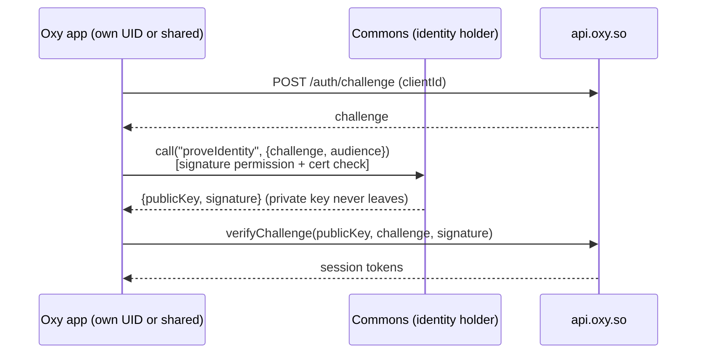

# Phase 2: stop sharing the Android UID (plan)

> Status: **PLAN, for owner review. Nothing here has shipped.** Tracking issue:
> OxyHQ/oxy#1388. Phase 1 (#1389, Block Store device backup) and the no-GMS
> warning are described in [device-backup.md](device-backup.md).

## Summary

Every Oxy Android app declares `android:sharedUserId="so.oxy.shared"`, so they
all run as one Linux UID. The Android Keystore belongs to a UID, which means
"Clear storage" on any one app wipes the Keystore of all of them, and with it the
Commons self-custody identity. Phase 1 recovers the identity from Block Store,
but only on devices with Google Play services.

Phase 2 removes the shared UID and keeps one Oxy account across all apps:

1. **Commons becomes the only holder of the identity.** No other app ever holds
   the private key. Other apps get identity proofs (a signed challenge), sessions
   and scoped derivations from Commons over IPC, guarded by a `signature`
   permission, the way apps get tokens from Android's `AccountManager` without
   ever seeing the password.
2. **New installs stop joining the UID.** Every app keeps
   `android:sharedUserId` and adds `android:sharedUserMaxSdkVersion="32"`. On
   Android 13 (API 33) and later, a new install gets its own UID.
3. **Existing installs cannot leave.** Android does not move an installed
   third-party app off a shared UID. They leave only through an uninstall and a
   reinstall. The plan therefore makes the IPC path work for both shared-UID and
   own-UID installs, so it no longer matters which kind a given install is.
   The shared UID then shrinks as devices reinstall and replace.

The order matters: the IPC path must be live everywhere **before** any app
leaves the UID. Adding `sharedUserMaxSdkVersion` is **one-way** for the installs
it affects (see [Rollback](#rollback)).

---

## 1. Inventory

Read at `origin/main` of each repo on 2026-09-25 (oxy at `6e6650a49`).

### 1.1 Apps that join `so.oxy.shared`

There are two ways an app joins:

- **The preset.** `['@oxy.so/app-preset', {}]` applies
  `withSharedUserId(config, 'so.oxy.shared')` unless it is passed `false`
  (`packages/app-preset/plugin/withOxyAppPreset.js:39-75`). It also applies the
  iOS keychain group (`withOxyKeychain`), `withOxyBuildProperties` and
  `@oxy.so/services/plugins/withSharedIdentityReader`.
- **A local copy of `plugins/withSharedUserId.js`** that hard-codes
  `'so.oxy.shared'`.

No repo sets `android:sharedUserLabel`.

| App | Repo | applicationId (prod / dev) | How it joins | Cross-app role |
|---|---|---|---|---|
| **Commons** | oxy `packages/commons` | `so.oxy.commons` / `.dev` | Local plugin, dev too | **Identity provider** (`withSharedIdentityProvider`) and **device-session provider** |
| **Accounts** | oxy `packages/accounts` | `so.oxy.accounts` / `.dev` | Local plugin, prod only | Identity reader; **device-session provider** (dev too, although dev is outside the UID) |
| test-app-expo | oxy `packages/test-app-expo` | none | Preset | Reader |
| create-oxy-app template | oxy `packages/create-oxy-app/templates/base` | `{{BUNDLE_ID}}` | Preset | Reader (every scaffolded app inherits it) |
| Mention | Mention `packages/frontend` | `earth.mention.app` / `.dev` | Local plugin, dev too | Reader |
| Alia | Alia `packages/app` | `onl.alia.app` | Local plugin | Reader |
| Allo | Allo `packages/frontend` | `com.allo.app` / `.dev` | Local plugin | Reader |
| Homiio | Homiio `packages/frontend` | `com.homiio.android` / `.dev` | Local plugin | Reader |
| CrowdSource reviewer | CrowdSource `packages/reviewer` | `so.oxy.crowdsource` / `.dev` | Local plugin | Reader |
| Peable | Peable `packages/frontend` | `to.peable.app` / `.dev` | Local plugin | Reader; **the FairCoin wallet derives from the shared private key** (`KeyManager.deriveScopedSeed`, `src/wallet/identity-wallet.ts:42`) |
| Atlas | Atlas `packages/frontend` | `so.oxy.atlas` / `.dev` | Preset | Reader |
| GoWay | GoWay `packages/frontend` | `to.goway.app` / `.dev` | Preset | Reader |
| Move (no git remote) | Move `packages/frontend` | `so.oxy.move` / `.dev` | Preset | Reader |
| Willo | Willo `packages/frontend` | `sh.willo.app` | Preset | Reader |
| Moovo (app, courier, tracker, hub) | Moovo `packages/{frontend,courier-app,tracker-app,fleet-dashboard}` | `now.moovo.app`, `.go`, `.tracker`, `.hub` | Preset sub-plugin | Reader |
| Noted | Noted `packages/frontend` | `so.oxy.noted` | Preset sub-plugin | Reader |

These apps do **not** join the UID: Clarity, Nilo, CRM, Inbox, Mercaria (all
three), Schedio and Syra (both). The CrowdSource console is web-only.

### 1.2 What is shared today, and how

The native code is in `packages/services/android/`. Every app that depends on
`@oxy.so/services` autolinks it. Its manifest is empty; the config plugins inject
the providers and permissions.

**Keystore aliases.** These are per UID, so one copy serves every app. This is
the hazard.

| Alias / key | Owner | What it wraps |
|---|---|---|
| expo-secure-store `key_v1` (default service) | every app | Legacy `oxy_identity_*` / `oxy_shared_*` values, plus each app's own secure-store values |
| expo-secure-store `oxy_identity`, `oxy_identity_backup` | Commons (any app that writes the identity) | The `_v2` identity key slots (`keyManager.ts:207-215`) |
| expo-secure-store `oxy_identity_mnemonic` | Commons | The recovery phrase (`keyManager.ts:234`) |
| androidx `_androidx_security_master_key_` | every app | Every `OxyEncryptedPrefs` file (`OxyEncryptedPrefs.kt:173-183`) |

**Per-app files** (each app has its own data directory, even under a shared UID)
are all encrypted with the shared master key above:

- `oxy_shared_identity`, keys `priv` and `pub` (`OxyIdentityStore.kt:29-31`). Only
  Commons writes it, through `KeyManager.syncSharedIdentity()`.
- `oxy_shared_device_session`, keys `deviceId` and `deviceSecret`
  (`OxyDeviceSessionStore.kt:49-51`). Every app writes its own copy through
  `createSharedMirroringAuthStateStore`.
- `oxy_background_session_<packageName>`, one per app.

**ContentProviders.** Both are `exported="true"`, answer only `call()`, and
re-check the caller with `checkSignatures(caller, self) == SIGNATURE_MATCH`.

| Provider | Authorities | Permission (`protectionLevel=signature`) | Method → data | Host |
|---|---|---|---|---|
| `so.oxy.identity.OxyIdentityProvider` | `so.oxy.commons.identity`, `so.oxy.commons.dev.identity` | `so.oxy.shared.permission.READ_IDENTITY` | `getShared` → `priv`, `pub` (the **raw private key**) | Commons |
| `so.oxy.devicesession.OxyDeviceSessionProvider` | `so.oxy.accounts[.dev].devicesession`, `so.oxy.commons[.dev].devicesession` | `so.oxy.shared.permission.READ_DEVICE_SESSION` | `read` → `status`, `deviceId`, `deviceSecret` | Accounts, Commons |

**Readers.** `withSharedIdentityReader` requests `READ_IDENTITY` and adds
`<queries><provider>` for the Commons authorities. **No reader requests
`READ_DEVICE_SESSION`:** `withSharedDeviceSessionReader` exists, but only its
own test uses it. Today's device-session reads work only because a caller with
the same UID passes a provider's permission check automatically. Once an app
leaves the UID, those reads fail.

**Identity read path.** `KeyManager.getSharedPublicKey` and `getSharedPrivateKey`
go through `OxyIdentityModule.readShared`, which reads:
1. the local `oxy_shared_identity` first,
2. then `content://so.oxy.commons[.dev].identity` → `getShared`.

Consumers:
- `SignatureService.signChallengeWithSharedKey`;
- `signInWithSharedIdentity` (the `shared-key-signin` cold-boot step);
- `deriveScopedSeed` (Peable's wallet);
- Commons' own `attemptIdentityRecovery`.

`createPackageContext` is used nowhere.

**Silent sign-in today** (`packages/core/src/boot/sessionColdBoot.ts`):
1. `warm-token-plant`
2. `device-secret-mint`
3. `shared-device-adopt`, which adopts a `{deviceId, deviceSecret}` read from a
   device-session provider or the app's own file
4. `shared-key-signin`, which signs a server challenge with the shared private key
5. signed out

Commons itself runs `sessionMode="identity"` (`identity-key-signin`). Without
Commons, the device lane can still succeed through Accounts; otherwise the app
shows the sign-in chooser (QR / device code approved from Commons on another
device, and a "Get Commons" link).

### 1.3 Defects the migration must fix on the way

- **The code misdescribes the shared data directory.** Comments in
  `OxyDeviceSessionStore.kt:36` and `OxyDeviceSessionModule.kt:68` say that UID
  members "see ONE data directory". They do not: each package has its own data
  directory, and only the Keystore is shared.
  - As a result, Mention's published device credential sits in Mention's own
    file, and no provider serves it.
  - Commons' device-session provider serves a file that Commons never writes.
  - Only Accounts' provider actually carries a credential.
- **The identity provider hands out the raw private key** to any app signed with
  the same certificate. Phase 2 replaces this with operations that use the key
  without releasing it.
- **The Accounts dev variant** hosts a device-session provider outside the UID,
  which contradicts `withSharedDeviceSessionProvider.js:21-27`.

---

## 2. Android mechanics and constraints

### 2.1 `sharedUserId` cannot be removed from an installed app

- **Deprecation.** [`android:sharedUserId`][manifest-element] has been
  deprecated since API 29. The reference says that shared user IDs cause
  non-deterministic behaviour in the package manager, that apps should use
  services and content providers instead, and that **existing apps cannot remove
  the value, because migrating off a shared user ID is not supported**. It tells
  those apps to add `android:sharedUserMaxSdkVersion` so that new user installs
  stop using the shared user ID.
- **Removing the attribute breaks updates.** If an update drops
  `android:sharedUserId`, or changes it, the package manager rejects the update
  on every device where the app is installed. The error is
  `INSTALL_FAILED_UID_CHANGED` or `INSTALL_FAILED_SHARED_USER_INCOMPATIBLE`,
  depending on the version. Play accepts the upload, and the update then fails
  on the device. **No release may ever remove or rename `sharedUserId`.**

### 2.2 `android:sharedUserMaxSdkVersion` (API 33+)

[`android:sharedUserMaxSdkVersion`][manifest-element], added in API 33, is the
highest SDK level on which the app still joins the shared user ID.

- **On Android 13+ with the value set to `32`:**
  - A **new install** gets its own UID.
  - An **existing install that updates** keeps its existing UID, which is the
    shared one.

  AOSP implements this in `SharedUidMigration`
  (`frameworks/base/services/core/java/com/android/server/pm/SharedUidMigration.java`).
  Its default strategy on user builds is `NEW_INSTALL_ONLY`. The strategies that
  move installed apps (`BEST_EFFORT`, `TRANSITION_AT_BOOT`) apply only to system
  apps and debug builds, not to Play-installed apps.
- **On Android 12L and below** (API ≤ 32), the attribute is ignored. **Every
  install, new or existing, keeps joining `so.oxy.shared` forever.** Those
  devices keep the hazard, so the Block Store backup and the no-GMS warning stay
  necessary there.
- The attribute needs `compileSdk ≥ 33`. Expo SDK 57 is already on a higher
  level.

### 2.3 What "migrating" an existing install means

| Case | UID after the release that adds `sharedUserMaxSdkVersion=32` | Data |
|---|---|---|
| New install, Android 13+ | Own UID | Starts empty; gets identity and session from Commons over IPC |
| New install, Android ≤ 12L | `so.oxy.shared` | Same as today |
| Existing install, update, any Android | Stays `so.oxy.shared` | Unchanged |
| Existing install, uninstall then reinstall, Android 13+ | Own UID | Everything local is gone, as with any uninstall |

- **No on-device path moves an installed app's data into a new UID.** Android
  has no API that re-parents a data directory or Keystore entries to another UID.
  An app that leaves does so as a fresh install with an empty data directory.
- **Nothing to migrate for siblings.** For every app except Commons, this
  costs nothing: their data is a session, which a fresh install gets back
  silently from Commons (section 3).
- **Commons is different.** A reinstall loses the identity unless a backup
  restores it (Block Store, the phrase, or the phrase-keyed encrypted backup).
  Section 4.4 covers Commons.

The hazard goes away without moving any data. The shared UID only threatens
Commons while another package shares it. Once every sibling on a device is
either an own-UID install or uninstalled, "Clear storage" on a sibling no longer
reaches Commons' Keystore, **even if Commons itself is still in
`so.oxy.shared`**. Clearing Commons' own storage is the user's own act on the app
that holds the identity. The phrase and the backups cover that case.

### 2.4 Signature permissions across UIDs

- **Permission checks start to apply.** Inside one UID, a provider's permission
  check is skipped: the caller's UID equals the provider's UID. Across UIDs, the
  caller needs a `<uses-permission>` for a
  [`signature` permission][protection-levels] declared by an app signed with
  the same certificate.
- **Install order.** A signature permission is granted when the requesting app is
  installed, if the defining app is already present. It is re-evaluated when the
  defining app is installed later. To avoid relying on that re-evaluation, and
  on uninstall and reinstall orders, **every Oxy app declares both permissions**
  (`<permission … protectionLevel="signature">`), as well as requesting them.
  Android allows several packages to declare the same permission when they share
  a signing certificate. It rejects a package with a different certificate
  (`INSTALL_FAILED_DUPLICATE_PERMISSION`), which is the protection we want.
  Every declaration must be identical, so one plugin in `@oxy.so/services` owns
  it.
- **Signing key rotation.** Rotation (APK Signature Scheme v3) keeps signature
  permissions working for apps whose lineage contains the old key. For a planned
  rotation, [`knownCerts` with `protectionLevel="signature|knownSigner"`][known-signer]
  (API 31+) lets the permission accept a listed certificate digest.
- **A second check inside the provider.** The permission is necessary but not
  enough. Inside `call()`, the provider maps `Binder.getCallingUid()` to its
  packages, then checks each with
  `PackageManager.hasSigningCertificate(pkg, cert, CERT_INPUT_SHA256)` (API 28+),
  or `checkSignatures` on older devices. Today's providers already do this.
- **Package visibility (API 30+).** Readers keep their `<queries><provider>`
  entries, which they already have for the identity authority. The same entries
  are added for the device-session authorities.

### 2.5 Precondition: one signing certificate

A shared UID already requires every member to be signed with the same
certificate. With Play App Signing, that is the **app signing key** Google holds
for each listing, not the upload key. Before starting, confirm this for every app
in 1.1 with `apksigner verify --print-certs` on the Play-delivered APK. Any app
signed differently is not actually sharing the UID today, and cannot receive the
signature permission.

---

## 3. Target architecture

### 3.1 Commons is the only holder

The identity private key, the phrase and the device backup exist only inside
Commons. No other app writes or reads the `oxy_identity*` slots. The shared slot
(`oxy_shared_identity` and the `getShared` method) is retired after the
compatibility window (section 4, step 6).

### 3.2 One IPC surface: `so.oxy.commons.identity`, version 2

The existing ContentProvider is kept, and new `call()` methods are added next to
`getShared`. It stays a provider rather than becoming a bound service for three
reasons:

- apps already `<queries>` it;
- Android starts the Commons process on demand for a `call()`;
- `call()` returns synchronously, which fits the cold-boot lane.

A bound AIDL service is the alternative if we later need streaming or a
long-lived connection. Nothing in the plan needs one.

| Method | Input | Output | Notes |
|---|---|---|---|
| `describe` | – | `{v: 2, publicKey, did, userId?}` | Capability probe. A missing method (old Commons) means "fall back". |
| `proveIdentity` | `{challenge, audience, nonce}` | `{publicKey, signature, alg}` | Signs `challenge` bound to the **calling package** and `audience` (the app's `clientId`). The caller package comes from `Binder.getCallingUid()`, never from the input. |
| `deriveScopedSeed` | `{scope}` | `{seed}` | Byte-identical to today's `KeyManager.deriveScopedSeed(scope)` over the same key, so Peable's wallet addresses do not change. Scope allow-list per caller package. |
| `readDeviceSession` / `writeDeviceSession` | `{deviceId, deviceSecret}` | `status` | Replaces the per-app `oxy_shared_device_session` files with one copy held by the host (Commons, and Accounts where Commons is absent). |

- **Guard.** Every method requires `READ_IDENTITY` (or `READ_DEVICE_SESSION`),
  the certificate check in 2.4, and a caller allow-list of the package names in
  1.1. That is the `AccountManager` model: callers get proofs and tokens, never
  the credential.
- **Consent.** Silent for Oxy-signed first-party apps, as today. A caller that is
  not on the allow-list is refused and logged.
- **Signed payload.** The server-side challenge format does not change. The
  signed payload adds `audience` and the caller package, so a proof minted for
  Mention cannot be replayed by another app. `verifyChallenge` accepts both
  forms during the window.

### 3.3 How silent sign-in keeps working

The cold-boot order in `@oxy.so/core` becomes:
1. `warm-token-plant`
2. `device-secret-mint`
3. `shared-device-adopt`, which reads the device session **through the host's
   provider only**
4. **`commons-proof-signin`**, new: `describe`, then `proveIdentity`, then
   `verifyChallenge`
5. `shared-key-signin` (legacy: `getShared`, then a local signature), kept only
   for the compatibility window
6. signed out

A new, own-UID install of Mention on a device with Commons therefore signs in
with no UI, exactly as a shared-UID install does today. Without Commons, the
behaviour is unchanged: Accounts' device session, then the chooser.

iOS is unaffected: it uses the keychain access group `group.so.oxy.shared`, and
no iOS app can wipe another app's keychain items. No iOS change is needed.

---

## 4. Rollout

Each step is a gate: do not start the next step until the gate is met. Adoption
is read from the Play Console (per version code) and from a new telemetry field,
`android.sharedUid`, which is true when `PackageManager.getNameForUid(myUid())`
starts with `so.oxy.shared:`. That field also tells us how fast the shared UID
empties.

### Step 0: SDK (oxy: `@oxy.so/services`, `@oxy.so/core`, `@oxy.so/app-preset`)

- **Services native code:**
  - `OxyIdentityModule` gains `describe`, `proveIdentity` and `deriveScopedSeed`
    clients;
  - `OxyDeviceSessionModule` reads and writes through the host's provider.
- **Plugins:**
  - a new `withOxySharedPermissions` declares **and** requests both permissions
    and adds `<queries>` for all four authorities;
  - the preset applies it;
  - `withSharedIdentityReader` and `withSharedDeviceSessionReader` fold into it.
- **Core:**
  - the `commons-proof-signin` lane, ordered before `shared-key-signin`;
  - `deriveScopedSeed` prefers the IPC method and falls back to the shared key;
  - an `android.sharedUid` telemetry field.
- **Preset:**
  - a `sharedUserMaxSdkVersion` option, **default off** in this release;
  - `withSharedUserId` writes both attributes when the option is set.
- **Server** (`@oxy.so/api`): `verifyChallenge` accepts the audience-bound proof.

The step ships as minor versions. It changes no behaviour for apps that do not
adopt it.

### Step 1: Commons release N (store build)

- Hosts the v2 methods alongside `getShared`.
- Declares both permissions through the plugin.
- Becomes the device-session host that siblings write to.
- Still in `so.oxy.shared`, with **no** max SDK yet.
- Test vectors prove that `deriveScopedSeed` over IPC equals the local
  derivation.

**Gate:** ≥ 90% of active Commons Android installs are on N or later.

### Step 2: every sibling, release with the new SDK (store builds; order among siblings does not matter)

- Services and core from step 0, plus `withOxySharedPermissions` (through the
  preset, or explicitly for apps with a local `withSharedUserId`).
- **Still in the UID, with no max SDK.** This release only adds the IPC path and
  the permissions, so the next step cannot strand anyone.
- Peable: the wallet must derive through IPC and match the previous addresses
  before release (a blocking test).

**Gate:** each app's own adoption ≥ 90%, and telemetry shows
`commons-proof-signin` succeeding at the same rate as `shared-key-signin` did.

### Step 3: siblings add `sharedUserMaxSdkVersion="32"` (store builds)

- Preset apps set the preset option. The apps with a local plugin (Mention,
  Alia, Allo, Homiio, CrowdSource, Peable, Accounts) switch to the preset's
  `withSharedUserId`, so there is one implementation.
- **Effect:** new installs on Android 13+ get their own UID and use IPC only.
  Existing installs are untouched.
- Start with one low-traffic app (e.g. Noted or Atlas) for a week, then the rest.

### Step 4: Commons adds `sharedUserMaxSdkVersion="32"` (store build)

This comes last among the manifest changes, because a new own-UID Commons must
be reachable by every sibling version still in the field.
- Old siblings (before step 2) reach it only through `getShared` with
  `READ_IDENTITY`, which they already request, so they keep working.
- Their device-session reads of Commons fall back to Accounts or the chooser,
  which is acceptable once step 2 adoption is ≥ 90%.

### Step 5: existing installs (optional, owner decision)

Existing installs stay in `so.oxy.shared` until they are reinstalled. There are
two options:

- **5a. Do nothing active, and let the UID shrink.** Siblings leave when they
  are reinstalled or when the device is replaced. Block Store (GMS) and the
  warning (no-GMS) cover Commons in the meantime. This is the recommendation for
  most apps.
- **5b. A guided "move Commons to protected storage" flow** for no-GMS devices,
  where the hazard is unrecovered:
  1. require a verified backup (the phrase confirmed by re-entry, or the
     encrypted backup created);
  2. uninstall Commons;
  3. reinstall it;
  4. restore.

  This moves Commons itself out of the UID. It is a real risk to the user's
  identity if the backup step is skipped, so it must hard-gate on the
  verification.

A third option, a **successor package** (a new applicationId without
`sharedUserId` that receives the identity over the signature-protected provider,
after which the old one is uninstalled), moves existing installs with no
reinstall and no backup step. It costs a new store listing and splits installs
and reviews. It is noted here for completeness and is not recommended unless 5a
proves too slow.

### Step 6: retire the private-key export

When telemetry shows no `getShared` callers for 60 days, and every sibling's
minimum supported version is at least its step 2 release:

- Commons stops answering `getShared` (it returns "unsupported");
- Commons stops writing `oxy_shared_identity` (`syncSharedIdentity` becomes a
  delete of the old file);
- core deletes the `shared-key-signin` lane and the shared-key path of
  `deriveScopedSeed`.

This removes the raw private key from IPC for good.

### What each release must contain

| Release | Must contain | Must not contain |
|---|---|---|
| SDK (step 0) | v2 IPC clients, `withOxySharedPermissions`, `commons-proof-signin` before `shared-key-signin`, `sharedUid` telemetry, preset option default off | Any change to `sharedUserId` |
| Commons N (1) | v2 provider methods, permission declarations, device-session host, `getShared` still served | `sharedUserMaxSdkVersion` |
| Sibling (2) | New SDK, permissions declared and requested, `<queries>` for all authorities | `sharedUserMaxSdkVersion` |
| Sibling (3) | `sharedUserMaxSdkVersion="32"` with `sharedUserId` unchanged | Removal or rename of `sharedUserId` |
| Commons (4) | `sharedUserMaxSdkVersion="32"` | Removal of `getShared` |
| Commons + SDK (6) | `getShared` retired, legacy lane deleted | – |

---

## 5. Backwards compatibility matrix

| Commons ↓ / Sibling → | Old sibling (shared UID, no v2) | New sibling, shared UID | New sibling, own UID |
|---|---|---|---|
| **Old Commons** (no v2) | Today | `describe` missing → legacy `getShared` lane | Legacy `getShared` lane (sibling has `READ_IDENTITY`); device session via Accounts or the chooser |
| **Commons N, shared UID** | Today | v2 lane | v2 lane |
| **Commons N, own UID** (new install after step 4) | `getShared` lane, which works because it requests `READ_IDENTITY`; device-session read of Commons fails → Accounts or chooser | v2 lane | v2 lane |
| **After step 6** | Signed out → chooser (such a sibling is below its minimum version) | v2 lane | v2 lane |

---

## 6. Testing

**Unit and contract tests** (CI, oxy):
- the provider methods' guards: permission, certificate, allow-list, and caller
  package taken from the Binder;
- `deriveScopedSeed` test vectors (IPC equals local, for every scope Peable
  uses);
- the boot-lane order and fallbacks in core;
- a plugin snapshot test proving that every app declares identical permissions
  and never drops `sharedUserId`.

**Device matrix** (manual, with a **test identity only**; never on a device that
holds a real identity, per the `pm clear` rule):

| Axis | Values |
|---|---|
| Android | 12L (API 32: the attribute is ignored, so this is the regression check), 13, 14, 15, 16 |
| Services | GMS (Pixel stock) and no-GMS: LineageOS; GrapheneOS without sandboxed Play; an AVD `default` (non-Google) system image, which is the cheap CI-able no-GMS target |
| Install history | Fresh install; update over a step 2 build; uninstall then reinstall |
| Install order | Commons first, sibling first, Commons installed last, Commons uninstalled |
| Version skew | Every cell of the section 5 matrix |

**Acceptance checks per cell:**
1. Silent sign-in into the sibling with no UI.
2. `getNameForUid` reports the expected UID.
3. **The core property:** on an own-UID sibling, "Clear storage" leaves Commons'
   identity intact with no recovery screen. This is the #1388 scenario
   inverted, and it must hold on no-GMS devices.
4. Peable wallet addresses are unchanged.
5. With Commons absent, the chooser appears. With Commons uninstalled and then
   reinstalled, recovery works as in device-backup.md.

---

## 7. Risks

| Risk | Likelihood | Impact | Mitigation |
|---|---|---|---|
| An update removes or renames `sharedUserId` by mistake → updates fail on every device | Low | Severe | Plugin snapshot test; the preset owns the attribute; the release checklist |
| `sharedUserMaxSdkVersion` shipped before the IPC path is adopted → new installs cannot sign in silently | Medium | High | Step gates; the preset option defaults off |
| Peable wallet derives different addresses over IPC → funds appear missing | Low | Severe | Blocking test vectors; fall back to the shared key while it exists; derivation code shared by both paths |
| An app signed with a different Play app-signing key → no permission grant | Low | High | The 2.5 audit before step 0 |
| Signature-permission grant depends on install order | Medium | Medium | Every app declares both permissions (2.4) |
| The IPC call cold-starts Commons and slows boot | Medium | Low | Measure; `describe` is cheap; the lane has a timeout and falls through |
| Existing installs keep the hazard for a long time | Certain | Medium | Block Store (GMS), the no-GMS warning, the `sharedUid` metric, option 5b |
| Android ≤ 12L never leaves the UID | Certain | Medium | Same as above; those devices shrink over time |
| The private key stays exported through `getShared` during the window | Certain | Medium | Step 6 with a date; `getShared` refuses callers that are not on the allow-list |
| Accounts dev variant or other config oddities break assumptions | Low | Low | Fix in step 0 |

## Rollback

- **Steps 0 to 2 are additive.**
  - Roll back by releasing the previous build or disabling the new lane: an OTA
    to the previous JavaScript, or a remote flag read by core that skips
    `commons-proof-signin`.
  - `getShared` and the legacy lane stay in place until step 6, so turning off
    v2 restores today's behaviour.
- **Steps 3 and 4 are one-way for the installs they affect.**
  - A new install made under `sharedUserMaxSdkVersion=32` has its own UID.
  - A later update that removed the attribute would ask Android to put that
    install into `so.oxy.shared`, which it refuses, and the update fails on
    those devices.
  - **Never roll back by removing the attribute.** Roll forward: fix the IPC path,
    or keep the legacy lane alive longer.
  - To stop the spread while a fix is prepared, pause the staged rollout in the
    Play Console. Installs made before the pause keep their own UID, which is
    safe, because the legacy lane serves them.
- **Step 6 is reversible** until the next Commons store build: `getShared` can
  be re-enabled by a remote flag in Commons during one release cycle.

---

## 8. Effort estimate

Engineer-days, excluding store review time and adoption waits.

| Repo | Work | Estimate |
|---|---|---|
| oxy: `@oxy.so/services` (Android) | v2 provider methods and clients, `withOxySharedPermissions`, device-session host write path, the `OxyDeviceSessionStore` comment and behaviour fix | 4–5 d |
| oxy: `@oxy.so/core` | `commons-proof-signin` lane, `deriveScopedSeed` over IPC, fallbacks, `sharedUid` telemetry, tests | 2–3 d |
| oxy: `@oxy.so/api` | Audience-bound challenge verification, accepting both forms | 1 d |
| oxy: Commons | Host methods, allow-list, test vectors, step 4 manifest, optional 5b flow (+3 d) | 2–3 d (+3 d) |
| oxy: Accounts | Device-session host parity, move to the preset's `withSharedUserId`, dev-variant fix | 1 d |
| oxy: `@oxy.so/app-preset` + create-oxy-app template | `sharedUserMaxSdkVersion` option, snapshot test | 0.5 d |
| Peable | Wallet via IPC, address-continuity tests, local plugin → preset | 2 d |
| Mention, Alia, Allo, Homiio, CrowdSource | SDK bump, local plugin → preset, two releases each (steps 2 and 3) | 0.5 d each → 2.5 d |
| Atlas, GoWay, Move, Willo, Noted, Moovo ×4, test-app-expo | Preset and SDK bump, two releases each | 0.25 d each → 2.5 d |
| QA | Device matrix in section 6, including no-GMS | 4–5 d |
| Step 6 cleanup | Retire `getShared`, the shared slot and the legacy lane | 1 d |

**Total:** about 23–27 engineer-days (about 5 weeks for one engineer). Calendar
time is dominated by the two ≥ 90% adoption gates, which puts it at roughly
8–12 weeks from start to step 4.

## Open questions for the owner

1. Step 5: 5a only (recommended), 5a + 5b for no-GMS devices, or the successor
   package?
2. Is silent `proveIdentity` for first-party apps acceptable, or should Commons
   show a one-time per-app consent (a user-visible change)?
3. The adoption threshold: is 90% right, or should it be stricter for Peable
   because of the wallet?
4. Step 6 sunset: 60 days without `getShared` callers, or a fixed date?

[manifest-element]: https://developer.android.com/guide/topics/manifest/manifest-element
[protection-levels]: https://developer.android.com/guide/topics/manifest/permission-element#plevel
[known-signer]: https://developer.android.com/reference/android/R.attr#knownCerts
